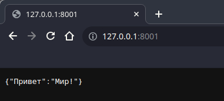

# Первые шаги

Для начала напишем самое легкое - сообщение "Привет мир!"

```python title='main.py'
{!../docs_src/base/example001.py!}
```
В браузере появляется JSON с ключом `Привет` и значением `Мир!`.



## Разберемся, что же мы написали

### 1 шаг: подключаем FastAPI
```python title='main.py' hl_lines="1"
{!../docs_src/base/example001.py!}
```
### 2 шаг: создаем экземпляр FastAPI
```python title='main.py' hl_lines="3"
{!../docs_src/base/example001.py!}
```
### 3 шаг: прописываем пути
```python title='main.py' hl_lines="6"
{!../docs_src/base/example001.py!}
```
### 4 шаг: объявляем функцию закрепленную за данным путем
```python title='main.py' hl_lines="7"
{!../docs_src/base/example001.py!}
```
### 5 шаг: возвращаем данные
```python title='main.py' hl_lines="8"
{!../docs_src/base/example001.py!}
```
## Обработчики запросов

Какие бывают методы и для чего они используются:

- `POST`: создание данных

- `GET`: чтение данных

- `PUT`: обновление данных

- `DELETE`: удаление данных

И всякие экзотические:

- `OPTIONS`

- `HEAD`

- `PATCH`

- `TRACE`

В спецификации OpenAPI, каждый из HTTP методов называются "запросами",
так что мы тоже будем их так называть.


